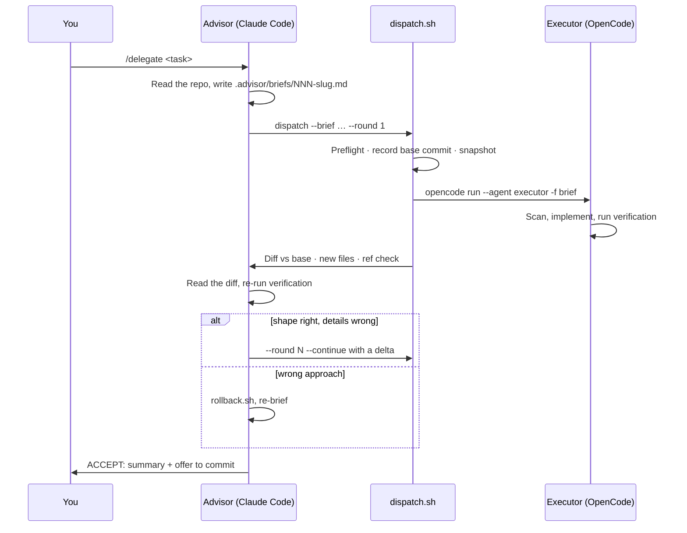

# delegate

**Claude Code designs the change and checks it. OpenCode writes the code.**

`delegate` is a [Claude Code](https://claude.com/claude-code) skill that sets
up an advisor/executor split. Claude Code acts as the staff engineer: it reads
the codebase, designs the change, and writes a precise brief. An
[OpenCode](https://opencode.ai) agent (the executor) does the implementation.
Claude Code then reviews the result itself, reading the diff and re-running
the checks, rather than trusting the executor's report.

```
/delegate Extract the API constants into a shared module used by both scrapers
```

## Why

Implementation is where most of the tokens go, and a fast coding model does
it well when the design is already decided. Judgment is harder to hand off:
what to build, where it goes, and whether the result is right. `delegate`
leaves judgment with the advisor and hands the typing to the executor.

This is one task at a time, supervised. Every change is reviewed before it
is accepted.

## How it works



1. **Brief.** The advisor fills in [`templates/brief.md`](templates/brief.md):
   goal, context, architecture, exact contracts, style constraints,
   verification commands, acceptance criteria, and what is out of scope.
2. **Dispatch.** [`bin/dispatch.sh`](bin/dispatch.sh) is the only thing that
   calls OpenCode. It refuses to start on a dirty tree, records the base
   commit, runs the executor under a timeout, and reports what changed.
3. **Review.** The advisor reads the diff against the base, reads every new
   file, and re-runs every verification command itself.
4. **Verdict.**
   - **ACCEPT**: offer to commit.
   - **CORRECT**: append a short delta to the brief and continue the
     executor's session.
   - **ROLLBACK**: [`bin/rollback.sh`](bin/rollback.sh) undoes the attempt,
     and the advisor re-briefs from scratch.

   After three rounds the advisor stops and hands the decision to you.

## What makes the review trustworthy

The review is only worth something if the diff shows everything the executor
did. The scripts check that mechanically:

| Risk | What guards against it |
|---|---|
| Your own changes mixed into the executor's | Dispatch refuses to start unless the tree is clean |
| Round 1's changes blurring the next round's diff | Every round is diffed against the commit recorded at the start |
| New files, which `git diff` never shows | Untracked files are snapshotted before and after each round, and new ones listed |
| The executor editing your brief or other untracked files | Reported from the same snapshot |
| The executor committing, resetting or stashing | Denied in the agent config, and every git ref is compared after the round (exit 21) |
| Rollback deleting your own files | Rollback deletes only files the executor created, and only if git still shows them as untracked |
| A hung executor still writing while you review | A timeout kills the executor's whole process group, not just the parent |

What these checks don't cover is in
[KNOWN-LIMITATIONS.md](KNOWN-LIMITATIONS.md). In short: the executor is not
sandboxed.

## Install

Requirements: Claude Code, OpenCode (tested with 1.18.32), git, and bash.

```sh
git clone https://github.com/lerichjam/delegate.git ~/.claude/skills/delegate
~/.claude/skills/delegate/install.sh
```

The clone location matters: the skill calls its scripts at
`~/.claude/skills/delegate/bin/`. `install.sh` symlinks the two files that
must live elsewhere, so this repository stays the only copy:

| File | Linked to |
|---|---|
| `agent/executor.md` | `~/.config/opencode/agent/executor.md` |
| `command/delegate.md` | `~/.claude/commands/delegate.md` |

The script finishes by checking that OpenCode lists the `executor` agent.

### Choosing the executor model

The model is set in the frontmatter of
[`agent/executor.md`](agent/executor.md). It defaults to
`opencode-go/deepseek-v4.1-flash` at temperature 0.1. Change it to any
provider/model that `opencode models` lists. To override it for a single
dispatch, pass `--model`.

## Usage

In any git repository with at least one commit and a clean working tree, run:

```
/delegate <what you want built>
```

or just ask Claude Code to "delegate this". The skill takes it from there.
The scripts can also be run by hand:

```sh
# Fresh start: needs a clean tree, records the base commit
bin/dispatch.sh --brief .advisor/briefs/001-slug.md --round 1

# Correction: continues the executor's session on the dirty tree
bin/dispatch.sh --brief .advisor/briefs/001-slug.md --round 2 --continue \
  --message "Apply the '## Round 2 delta' section at the end of the attached brief."

# Undo the delegation back to its base
bin/rollback.sh --brief .advisor/briefs/001-slug.md
```

[SKILL.md](SKILL.md) is the reference for every flag, every exit code, and
what the advisor does with each one.

### What it writes in your repo

```
.advisor/
├── briefs/NNN-slug.md    # the briefs: commit these alongside the change
└── runs/                 # executor logs, base commit, file ledgers
                          # (ignores itself, so logs never reach a commit)
```

## Layout

```
SKILL.md                the advisor's workflow: what Claude Code follows
agent/executor.md       the OpenCode executor: permissions and system prompt
command/delegate.md     the /delegate slash command
templates/brief.md      the brief's nine sections
bin/dispatch.sh         preflight, invocation, timeout, report
bin/rollback.sh         undo a delegation to its base
bin/lib.sh              exit codes and snapshots shared by both scripts
install.sh              symlinks + agent resolution check
tests/                  plain-bash suite with a stub opencode
```

## Tests

```sh
bash tests/test_dispatch.sh
```

The suite is plain bash, with no bats or shellcheck needed. Each case runs in
a throwaway git repository against a stub `opencode` that copies the real
CLI's argument quirks. It also checks that SKILL.md documents every exit code
and flag the scripts implement, and that the executor's git deny list is in
place.

## Not to be confused with

`ralf-opencode` and similar loops grind through many issues unattended.
`delegate` is the opposite trade-off: one task, with the advisor reading
every diff.
